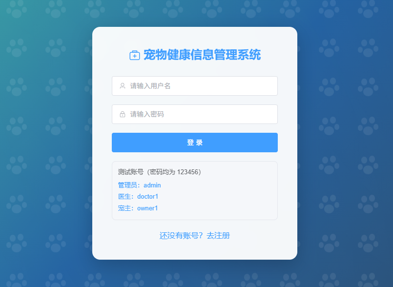
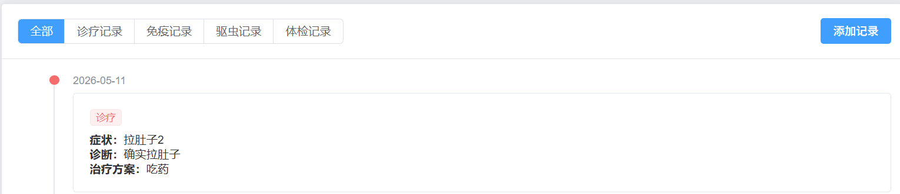
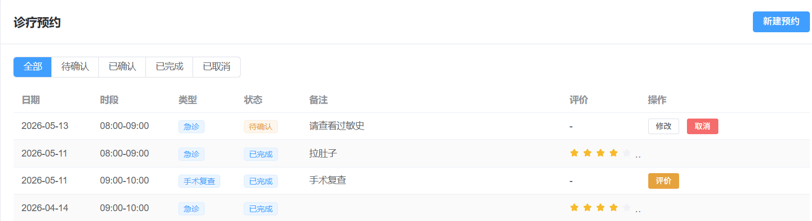

# 宠物健康信息管理系统

## 项目定位

这是一个面向宠物主人、宠物医生和平台管理员的宠物健康服务平台。系统把宠物基础档案、就诊/健康记录、预约咨询和后台运营集中到同一套系统中，适合演示宠物医院或宠物健康管理平台的核心业务流程。

## 角色与功能模块

- 宠物主人端：注册登录、维护宠物档案、查看健康记录、提交医生预约、查看预约状态、进行在线咨询。
- 医生端：查看待处理预约、了解宠物历史健康信息、处理咨询和补充健康记录。
- 管理员端：管理用户和角色、维护医生及服务信息、查看宠物与健康数据、进行运营统计。
- 数据模块：宠物基本信息、健康/就诊记录、预约信息、咨询信息和系统通知等。

## 技术实现

- 后端：Java、Spring Boot、Spring Security、JWT、MyBatis-Plus、MySQL。
- 前端：Vue 3、TypeScript、Vite、Vue Router/Pinia、Element Plus、Axios、ECharts。
- 实现方式：前后端分离，使用 JWT 完成登录鉴权，通过 REST API 连接前端页面和业务服务，使用 MySQL 保存业务数据。

## 可以做什么

可用于宠物医院信息化、宠物健康档案、预约问诊和宠物服务平台等场景，也可以在此基础上扩展疫苗提醒、处方记录、支付、消息推送等功能。

## 模块说明

| 模块 | 主要内容 |
| --- | --- |
| 账号与权限 | 区分宠物主人、医生和管理员的操作范围，控制不同角色可访问的页面和接口。 |
| 宠物档案 | 保存宠物基础资料，支持宠物主人查看和维护自己的宠物信息。 |
| 健康记录 | 记录就诊、症状、护理等健康信息，形成可持续查看的宠物健康档案。 |
| 预约咨询 | 提供医生预约、预约状态查看和在线咨询等服务入口。 |
| 运营管理 | 管理用户、医生、宠物及业务记录，并通过统计图表了解平台运行情况。 |

## 典型使用流程

宠物主人注册登录后建立宠物档案，查看或补充健康记录，再选择医生和时间提交预约；医生在后台查看预约和宠物历史信息并处理咨询；管理员负责基础数据维护、权限管理和运营统计。

## 技术分工

Spring Security 与 JWT 负责登录和接口鉴权；MyBatis-Plus 负责实体数据持久化；Vue 3 负责页面组件和交互；Pinia 管理前端状态；Element Plus 提供后台表格、表单和弹窗组件；ECharts 用于健康和运营数据可视化。

## 实际运行效果

以下为论文中提取的系统运行界面截图，已避开个人信息与学校标识。

[返回项目总览](../README.md)
