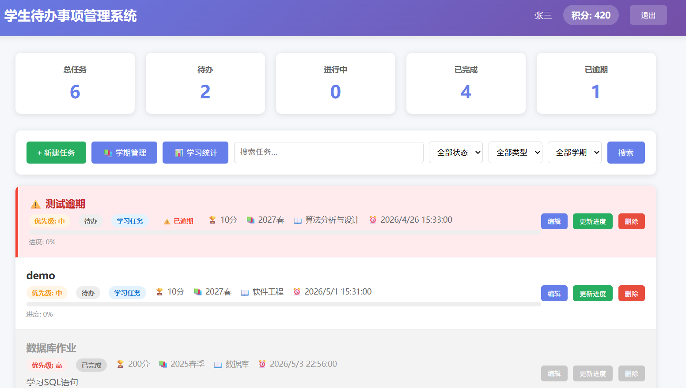
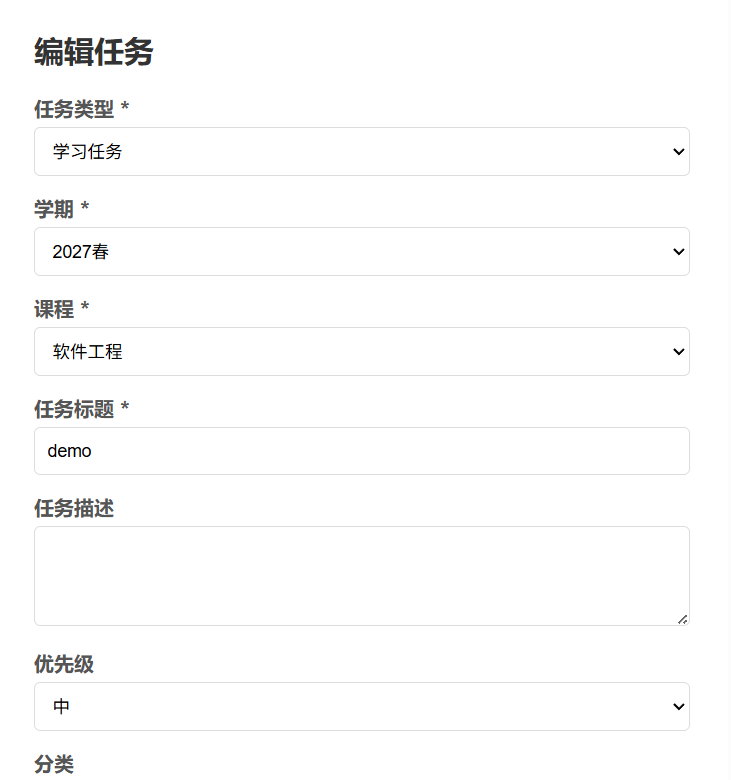
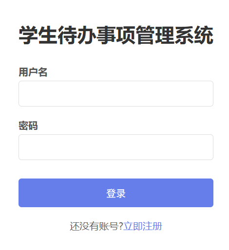

# 学生待办事项管理系统

## 项目定位

这是一个帮助学生集中管理课程任务、学习计划和日常事项的前后端分离 Web 系统。用户可以创建待办、设置优先级和状态，并通过筛选及统计功能了解任务完成情况。

## 功能模块

- 用户模块：登录、退出和当前用户信息管理。
- 待办模块：新增、编辑、删除、查看任务，切换待办/进行中/已完成等状态。
- 分类与筛选：按关键字、分类、优先级和完成状态查找任务。
- 计划管理：根据学习阶段或时间安排组织任务，便于持续跟踪。
- 统计模块：汇总任务总量、完成量和不同状态的分布，辅助学习复盘。

## 技术实现

- 后端：Java、Spring Boot、Spring Data JPA、MySQL。
- 前端：Vue、Vue Router、Axios、Vite。
- 实现方式：前后端分离，后端提供任务和用户 REST 接口，JPA 负责实体与数据库表的映射，前端完成列表、表单、筛选和统计页面。

## 可以做什么

可用于个人任务清单、课程作业跟踪、学习计划管理和轻量级团队任务看板，也适合作为 Spring Boot + Vue 增删改查项目的基础模板。

## 模块说明

| 模块 | 主要内容 |
| --- | --- |
| 账号模块 | 完成用户登录和当前用户识别，保证用户只能查看和操作自己的任务。 |
| 待办模块 | 对任务进行新增、编辑、删除、详情查看和完成状态切换。 |
| 分类与优先级 | 为任务设置分类、优先级和截止安排，方便按学习场景整理。 |
| 查询筛选 | 支持按关键字、状态、分类和优先级组合筛选任务。 |
| 统计分析 | 汇总任务数量、完成数量和状态分布，帮助用户复盘计划执行情况。 |

## 典型使用流程

用户登录后创建待办事项，填写标题、描述、分类和优先级；在任务列表中按条件筛选，执行任务后切换状态；系统根据任务状态生成统计结果，便于查看学习计划完成度。

## 技术分工

Spring Boot 提供用户和待办事项接口；Spring Data JPA 负责实体关系映射和数据库访问；MySQL 保存用户、任务及分类数据；Vue 负责列表、表单和统计页面；Vue Router 管理页面路由，Axios 负责前后端接口通信。

## 实际运行效果

以下为论文中提取的实际运行界面截图，使用演示数据且不包含个人信息。

[返回项目总览](../README.md)
