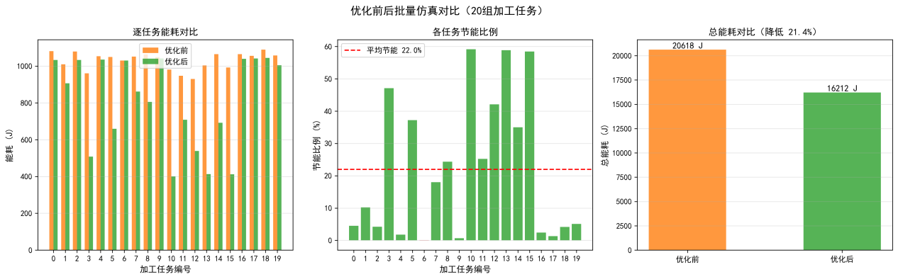
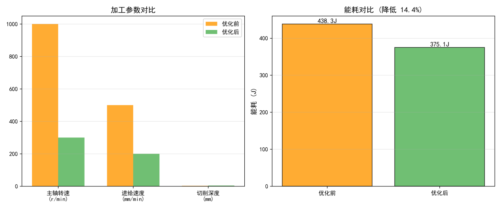
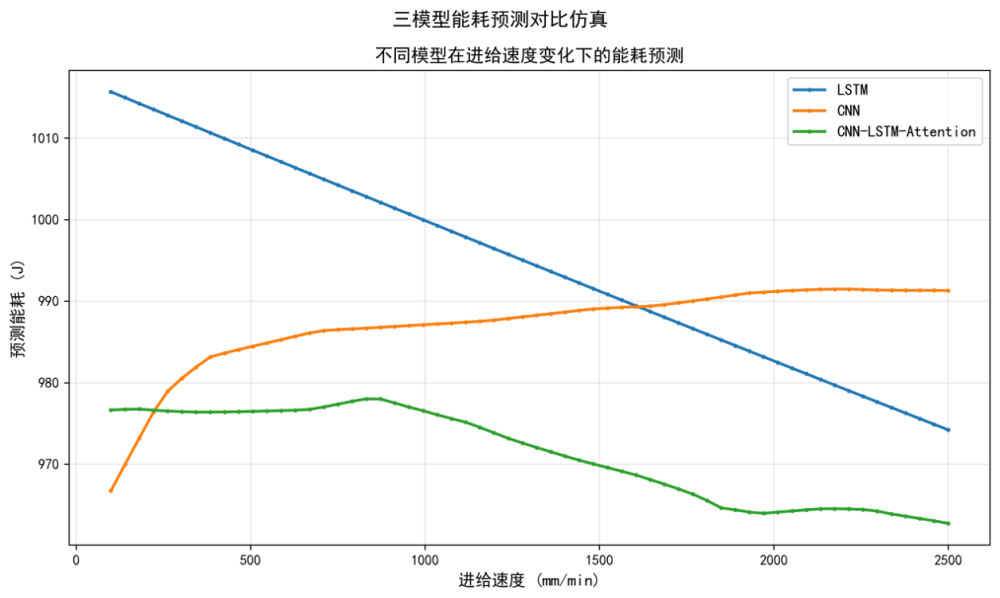

# 数控机床能耗预测与优化系统

## 项目定位

这是一个面向数控机床运行数据分析的机器学习与多目标优化项目。系统从历史运行数据中学习能耗变化规律，对未来能耗进行预测，并进一步寻找兼顾能耗、加工效率等目标的参数组合。

## 功能模块

- 数据处理模块：读取运行数据，完成清洗、归一化、训练集/测试集划分和特征整理。
- 预测建模模块：支持 LSTM、CNN、CNN-LSTM-Attention 等时序预测模型的训练与推理。
- 模型对比模块：计算误差指标，生成不同模型的预测曲线和对比图表。
- 优化模块：结合 NSGA-II 多目标遗传算法搜索参数方案，输出 Pareto 前沿结果。
- 可视化模块：展示原始数据、预测结果、模型指标和优化前后对比。
- 交互展示模块：通过 Streamlit 提供参数配置、模型运行和结果查看页面。

## 技术实现

- Python：Pandas、NumPy、scikit-learn 负责数据处理与基础评估。
- 深度学习：PyTorch 实现时序预测网络、训练循环、模型保存和加载。
- 优化与绘图：NSGA-II、Matplotlib、Seaborn。
- 展示：Streamlit 构建可交互的数据分析和模型演示页面。

## 可以做什么

可用于数控设备能耗分析、工业时序预测、设备参数优化和节能方案对比，也可以改造成其他设备的故障预测、产量预测或运行指标优化项目。

## 模块说明

| 模块 | 主要内容 |
| --- | --- |
| 数据预处理 | 对机床运行数据进行读取、清洗、归一化和样本切分，为模型训练准备输入。 |
| 时序预测 | 使用不同深度学习结构学习设备运行数据与能耗之间的关系，输出预测值。 |
| 模型评估 | 计算误差指标，绘制真实值与预测值曲线，并比较各模型表现。 |
| 参数优化 | 将预测模型作为评价依据，通过 NSGA-II 搜索多个目标之间的折中解。 |
| 可视化展示 | 在 Streamlit 页面中展示数据、模型结果、评价指标和 Pareto 前沿。 |

## 典型使用流程

先导入历史运行数据并完成预处理，再选择模型进行训练或加载已有权重；系统输出预测曲线和评估指标后，进入多目标优化环节，查看不同参数方案及其能耗/效率权衡，最后导出图表或结果数据。

## 技术分工

Pandas 和 NumPy 负责数据整理及数值计算；PyTorch 负责网络结构、训练循环和模型推理；scikit-learn 提供数据划分和部分评估工具；NSGA-II 完成多目标搜索；Matplotlib/Seaborn 负责绘图；Streamlit 将实验脚本封装为可交互页面。

## 实际运行效果

以下为论文中提取的实验结果与运行展示图，不含个人信息或学校标识。

[返回项目总览](../README.md)
