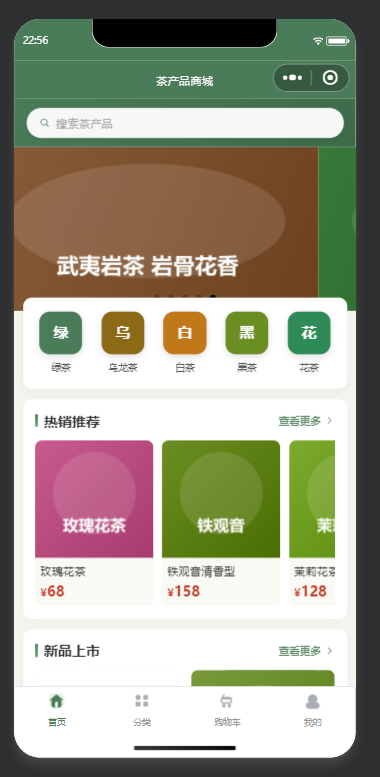
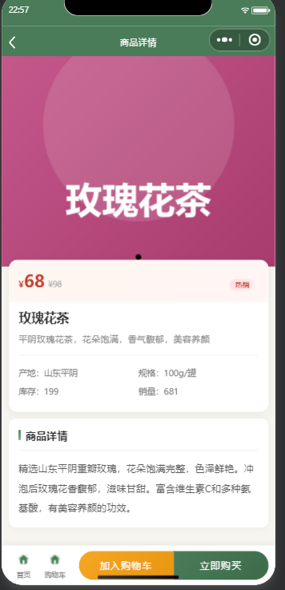
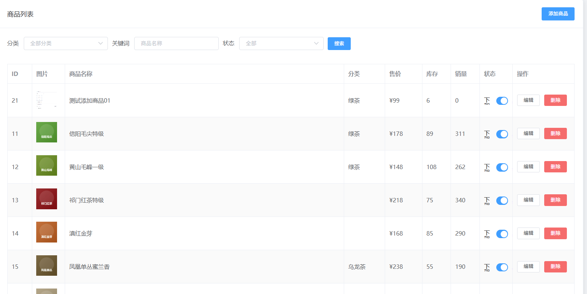

# 茶产品销售微信小程序

## 项目定位

这是一个面向茶产品展示和线上交易的微信小程序电商项目，覆盖用户端浏览购买和管理端商品、库存、订单处理等环节，适合演示小程序电商的完整业务闭环。

## 功能模块

- 小程序首页：轮播/推荐内容、茶产品入口和茶文化内容展示。
- 商品模块：按分类浏览茶产品，查看商品图片、价格、库存和详细介绍。
- 购物模块：加入购物车、调整数量、确认订单和查看订单状态。
- 用户模块：登录、个人信息和历史订单查看。
- 后台商品模块：商品增删改查、分类维护、图片上传和库存维护。
- 后台订单模块：查看订单、处理订单状态和跟踪销售情况。

## 技术实现

- 后端：Java、Spring Boot、MyBatis-Plus、MySQL、JWT。
- 小程序端：微信小程序原生开发，使用 WXML、WXSS、JavaScript 编写页面和交互。
- 实现方式：小程序通过接口访问后端服务，后端负责登录鉴权、商品/订单业务和数据库持久化，图片资源通过上传功能管理。

## 可以做什么

可用于茶叶、农产品、食品、文创商品等小型商城，也可以继续扩展优惠券、支付、物流、评价、收藏和营销活动等功能。

## 模块说明

| 模块 | 主要内容 |
| --- | --- |
| 商品与分类 | 展示茶产品图片、价格、库存和详情，支持按茶类或商品分类浏览。 |
| 小程序首页 | 提供推荐内容、商品入口和茶文化内容，作为用户进入商城的主要页面。 |
| 购物车与订单 | 选择商品、调整数量、确认订单并查看订单处理状态。 |
| 用户中心 | 管理登录状态、个人信息和历史订单。 |
| 后台管理 | 维护商品、分类、图片、库存和订单，支持管理员处理日常商城业务。 |

## 典型使用流程

用户在微信小程序中浏览首页和商品分类，进入商品详情后加入购物车并提交订单；后台人员维护商品和库存，查看订单并更新处理状态；库存数据随着商品业务操作同步变化。

## 技术分工

Spring Boot 提供商品、用户、订单和库存接口；MyBatis-Plus 简化数据库 CRUD 和条件查询；MySQL 保存商城业务数据；JWT 处理登录鉴权；原生微信小程序使用 WXML、WXSS 和 JavaScript 实现页面、交互及接口调用。

## 实际运行效果

以下为论文中提取的小程序和后台实际运行界面截图，已避开个人信息与学校标识。

[返回项目总览](../README.md)
