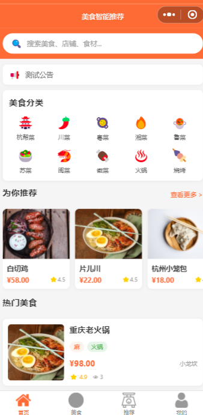
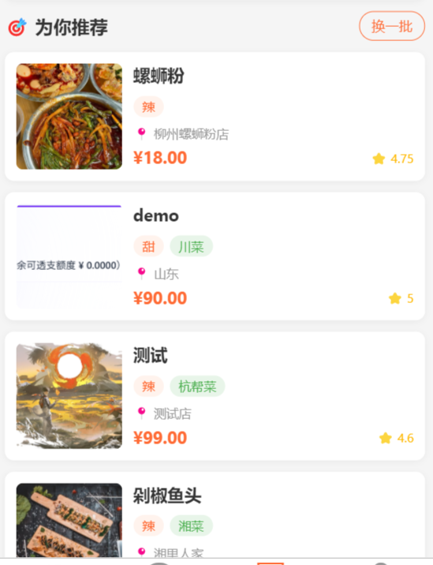
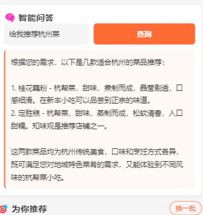

# 美食智能推荐微信小程序

## 项目定位

这是一个把美食内容浏览和推荐算法结合起来的微信小程序。用户可以搜索和查看美食，通过点赞、收藏、评分等行为形成偏好，系统据此生成个性化推荐，并提供知识库问答能力。

## 功能模块

- 美食内容模块：美食分类、关键词搜索、图片和详情介绍。
- 用户行为模块：点赞、收藏、评分和浏览行为记录。
- 推荐模块：结合协同过滤、内容特征和用户行为生成推荐结果，并记录推荐日志。
- 知识图谱/问答模块：组织菜品、食材、口味等关系，为用户提供美食相关的智能问答。
- 用户模块：登录、个人收藏和推荐内容查看。
- 管理后台：维护美食数据、分类、用户行为和推荐相关内容。

## 技术实现

- 后端：Python、Django、Django REST Framework、PyMySQL、JWT。
- 客户端：微信小程序原生页面和交互。
- 算法与数据：协同过滤、内容推荐、知识图谱；使用接口将推荐结果和问答结果返回给小程序。

## 可以做什么

可用于美食推荐、菜谱推荐、旅游内容推荐和生活服务信息流，也可将推荐对象替换为电影、商品、课程或文章。

## 模块说明

| 模块 | 主要内容 |
| --- | --- |
| 美食内容 | 提供分类、搜索、详情、图片和菜品信息浏览。 |
| 用户行为 | 记录点赞、收藏、评分和浏览等行为，作为推荐依据。 |
| 推荐服务 | 根据用户偏好、内容特征和相似用户行为生成推荐列表。 |
| 知识库问答 | 组织菜品、食材、口味等知识关系，回答美食相关问题。 |
| 推荐记录 | 保存推荐结果和用户反馈，便于分析推荐效果。 |
| 管理后台 | 维护美食、分类、用户和推荐基础数据。 |

## 典型使用流程

用户登录后浏览和搜索美食，并通过点赞、收藏或评分表达偏好；系统根据行为和内容特征生成推荐；用户也可以通过知识问答查询食材、菜品或口味信息，后台负责维护内容和查看推荐记录。

## 技术分工

Django 负责业务模型和服务端逻辑；Django REST Framework 提供小程序调用的 API；PyMySQL 连接业务数据库；JWT 管理用户身份；协同过滤和内容推荐负责个性化排序；知识图谱用于组织实体关系和增强问答上下文；微信小程序负责移动端展示与交互。

## 实际运行效果

以下为论文中提取的实际运行界面截图，使用演示数据且不含个人信息或学校标识。

[返回项目总览](../README.md)
