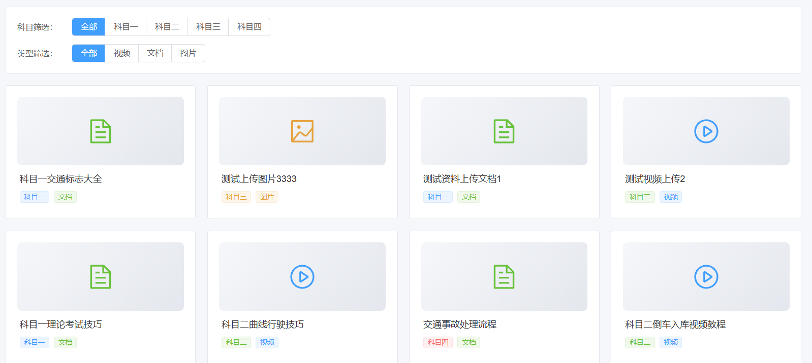
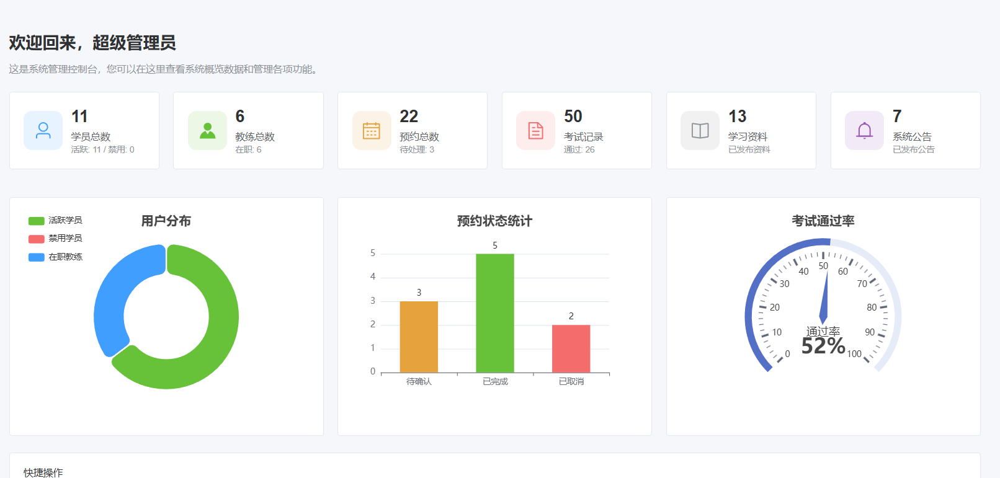
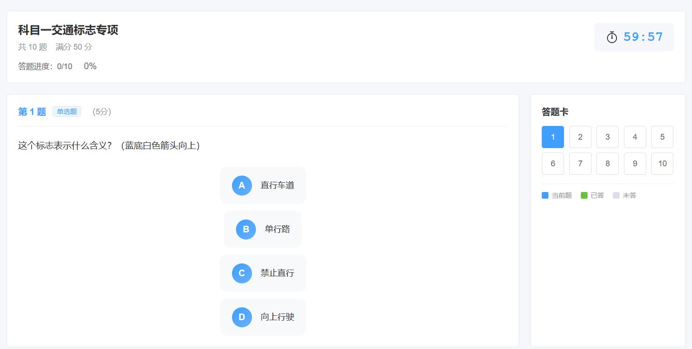

# 驾校在线预约平台

## 项目定位

这是一个面向驾校学员、教练和管理员的在线学车服务平台。系统将教练排班、学车预约、学习资料和理论考试整合在一起，覆盖从预约学习到考试练习的主要流程。

## 功能模块

- 学员模块：注册登录、查看教练和可预约时段、提交/取消预约、查看学习资料。
- 教练模块：维护可预约时段、查看预约安排和学员学习情况。
- 题库考试模块：按科目练习理论题，进行在线答题，查看成绩和错题。
- 资料模块：按科目筛选视频、文档和图片等学习材料。
- 管理模块：管理学员、教练、预约、题目、学习资料和平台基础配置。
- 统计模块：查看预约状态、考试记录和平台运营数据。

## 技术实现

- 后端：Java、Spring Boot、Spring Security、JWT、Spring Data JPA、MySQL。
- 前端：Vue 3、TypeScript、Pinia、Element Plus、Vite、Axios。
- 实现方式：采用前后端分离和角色权限控制，后端处理预约、题库和考试业务，前端提供管理后台和学员使用页面。

## 可以做什么

可用于驾校预约、培训机构排课、课程预约和在线题库系统，也可以扩展支付、学时统计、消息提醒和教练评价等功能。

## 模块说明

| 模块 | 主要内容 |
| --- | --- |
| 学员服务 | 注册登录、查看教练和时段、提交或取消预约、浏览学习资料。 |
| 教练排班 | 维护可预约时段，查看自己的预约安排和学员学习任务。 |
| 预约管理 | 保存预约日期、时间、教练和学员信息，跟踪预约处理状态。 |
| 学习资料 | 按科目整理视频、文档和图片等资料，供学员在线学习。 |
| 理论考试 | 提供题库练习、在线答题、成绩查看和错题回顾。 |
| 后台管理 | 维护学员、教练、题目、资料、预约和平台基础配置。 |

## 典型使用流程

学员登录后查看教练和可预约时间，提交学车预约；教练在后台查看排班和预约；学员进入资料或题库模块学习、答题并查看成绩；管理员负责人员、题库、资料和业务状态维护。

## 技术分工

Spring Security 与 JWT 负责多角色登录鉴权；Spring Data JPA 负责预约、题库和用户实体持久化；MySQL 保存业务数据；Vue 3、TypeScript 和 Pinia 负责前端页面、状态和交互；Element Plus 提供管理端组件；Vite 用于前端构建和开发。

## 实际运行效果

以下为论文中提取的实际运行界面截图，已避开学校标识、个人姓名和学号。

[返回项目总览](../README.md)
