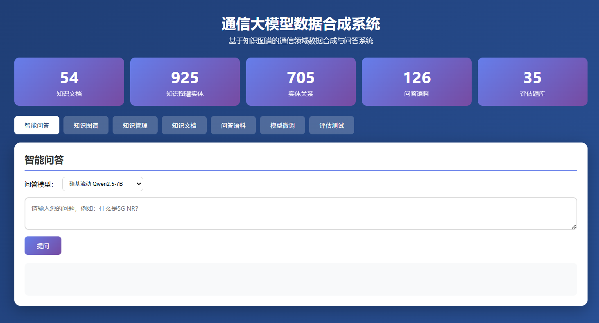
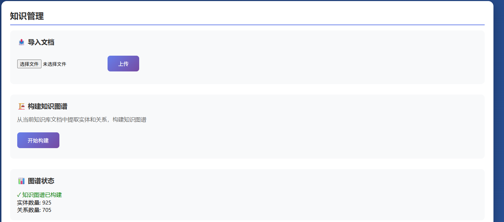
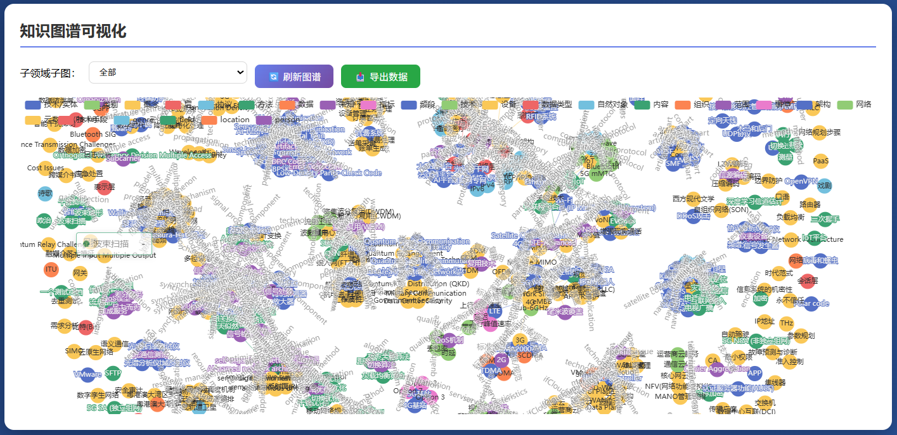

# 通信领域知识图谱与大模型数据合成系统

## 项目定位

这是一个面向通信领域语料处理和问答数据构建的知识增强系统。系统将领域文本整理为知识图谱和可检索知识库，再结合 RAG 与大模型生成问答样本，并对生成结果进行质量评估和导出。

## 功能模块

- 语料管理：导入、清洗和整理通信领域文本，形成可处理的知识资料。
- 知识抽取：识别领域实体、属性和关系，构建结构化知识。
- 知识图谱：查看实体关系网络，支持对领域知识进行组织和分析。
- 检索增强：建立向量检索/知识库索引，为大模型提供相关上下文。
- 问答生成：根据知识内容生成领域问答、指令数据或训练样本。
- 质量评估：从相关性、完整性等维度检查生成结果，保存评估记录。
- 结果管理：查看、筛选和导出知识图谱数据、问答数据及处理结果。

## 技术实现

- 核心开发：Python、知识图谱、向量检索、RAG/LightRAG、LLM API。
- 附带部署材料：项目内置的 LightRAG 组件包含 Docker、Helm、Kubernetes 配置，可用于相关组件的部署参考；核心数据合成服务本身以 Python 为主。
- 系统流程：语料处理 → 实体关系构建 → 知识检索 → 大模型生成 → 质量评估 → 数据导出。

## 可以做什么

可用于通信知识库、企业内部智能问答、领域问答数据集构建和大模型训练数据合成，也可以迁移到金融、医疗、制造等其他专业领域。

## 模块说明

| 模块 | 主要内容 |
| --- | --- |
| 语料处理 | 对原始通信文本进行清洗、切分、格式整理和任务数据准备。 |
| 实体关系抽取 | 从领域语料中识别实体、属性和关系，生成结构化知识。 |
| 图谱管理 | 展示实体关系网络，支持按主题查看和管理领域知识。 |
| 检索增强 | 对知识内容建立索引，在生成前检索相关上下文，减少回答脱离资料的问题。 |
| 数据合成 | 调用大模型生成问答、指令或训练样本，并保存生成结果。 |
| 质量评估 | 对样本进行规则或指标评估，筛选可用数据并导出。 |

## 典型使用流程

导入通信领域语料后，系统先进行清洗和实体关系处理，再构建知识图谱或检索索引；用户选择生成任务后，系统检索相关知识并调用大模型生成问答；生成结果经过质量评估后，可继续筛选、查看和导出。

## 技术分工

Python 负责数据处理、任务编排和服务接口；知识图谱用于保存实体关系；RAG/LightRAG 和向量检索负责召回相关知识；LLM API 负责问答和数据生成；项目内附的 LightRAG 组件提供 Docker、Helm、Kubernetes 部署配置，可作为组件化部署参考。

## 实际运行效果

以下为论文中提取的系统运行界面截图，已避开学校标识和个人信息。

[返回项目总览](../README.md)
