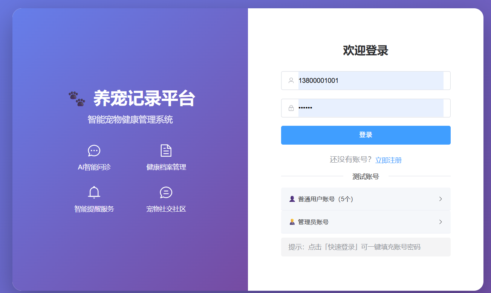
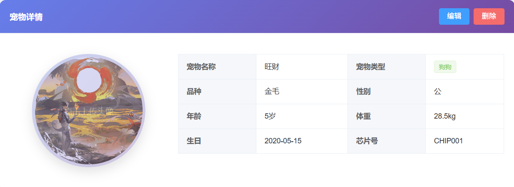

# 养宠记录平台

## 项目定位

这是一个以宠物主人为主要用户的养宠记录和健康管理平台。系统既能保存宠物的日常健康信息，也提供症状分析、知识查询和社区互动功能，适合演示宠物服务类平台的用户端与管理端流程。

## 功能模块

- 用户模块：注册登录、个人信息和权限控制。
- 宠物档案：维护宠物名称、品种、年龄、照片等基础资料，支持管理多只宠物。
- 健康记录：记录体重、症状、就诊、用药或护理信息，并查看健康变化趋势。
- 智能问诊：输入宠物症状，调用 Python AI 服务进行辅助分析和结果返回。
- 知识库：浏览宠物护理、疾病预防和日常养护相关内容。
- 社区模块：发布动态、浏览内容、互动交流。
- 后台管理：维护用户、宠物、健康内容和平台统计数据。

## 技术实现

- 后端：Java、Spring Boot、MyBatis-Plus、MySQL、Redis、JWT。
- 前端：Vue 3、Vue Router、Axios、Element Plus 等组件化技术。
- AI 服务：Python 服务负责症状分析等智能能力，通过接口与主系统连接。
- 系统特点：前后端分离，Redis 用于缓存或临时数据处理，JWT 用于接口鉴权。

## 可以做什么

可用于宠物健康档案、宠物社区、宠物医院会员服务和宠物知识问答，也可以扩展疫苗提醒、在线问诊、宠物商城和服务预约。

## 模块说明

| 模块 | 主要内容 |
| --- | --- |
| 用户与权限 | 处理用户注册登录、身份识别和不同角色的访问范围。 |
| 宠物档案 | 支持一个用户维护多只宠物，保存宠物基础信息和档案内容。 |
| 健康记录 | 记录体重、症状、就诊、护理等信息，形成连续的健康历史。 |
| 智能分析 | 将症状或咨询内容发送到 Python AI 服务，返回辅助分析结果。 |
| 知识库 | 提供宠物疾病预防、护理和日常养护内容的查询入口。 |
| 社区互动 | 支持动态发布、浏览和交流，形成宠物主人内容社区。 |
| 后台运营 | 管理用户、宠物、健康内容、社区内容和统计数据。 |

## 典型使用流程

用户登录后创建宠物档案，持续补充健康记录；出现健康问题时可使用智能问诊或知识库进行辅助查询；用户还可以在社区发布和查看养宠内容；管理员在后台维护内容并查看平台运行数据。

## 技术分工

Spring Boot 承担主业务接口和权限控制；MyBatis-Plus 负责数据访问；MySQL 保存用户、宠物和健康记录；Redis 用于缓存或临时业务数据；Vue 3 构建管理端页面；Python AI 服务提供独立的症状分析能力，并通过接口与主系统协作。

## 实际运行效果

以下为论文中提取的实际运行界面截图，使用演示数据且不含个人信息或学校标识。

[返回项目总览](../README.md)
