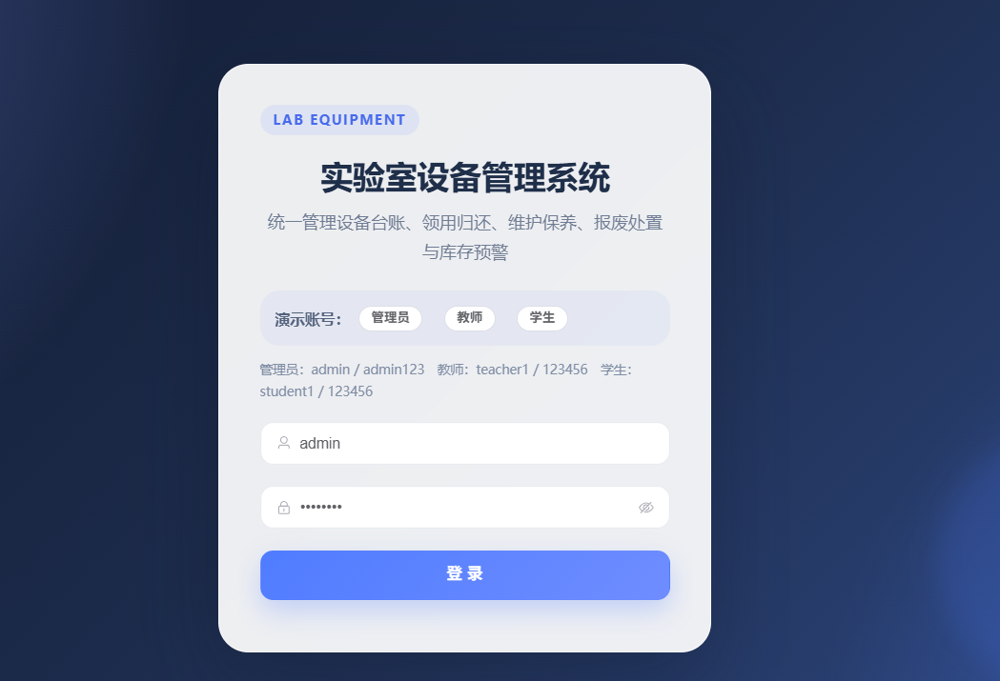
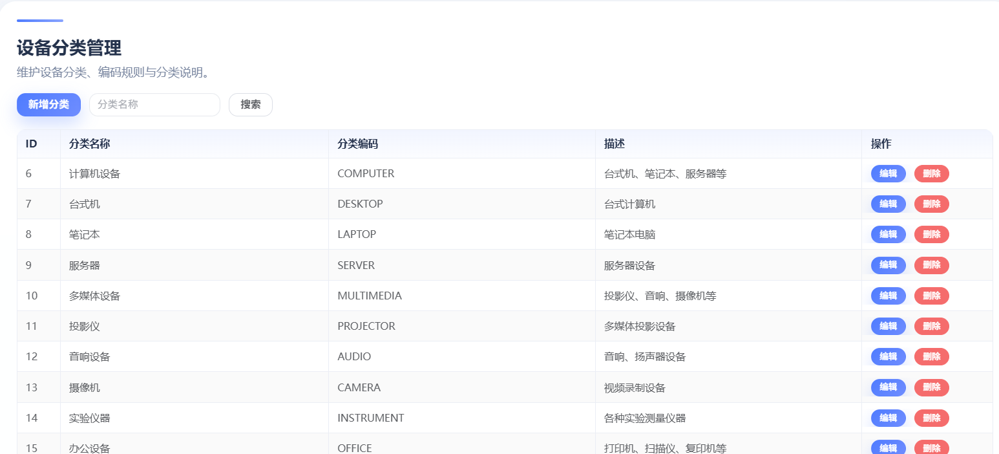
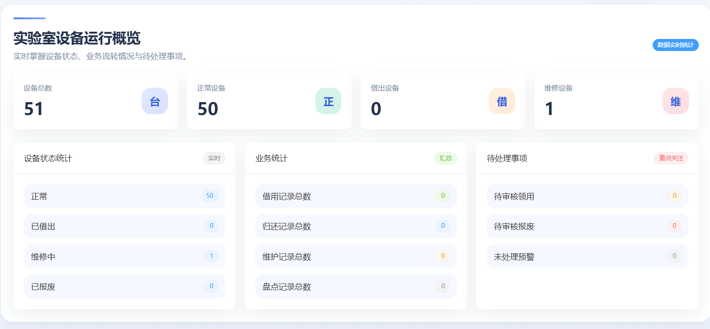

# 实验室设备管理系统

## 项目定位

这是一个面向实验室管理人员和设备使用人员的设备全生命周期管理系统。系统从设备入库、台账登记，到借用、归还、维修、报废和盘点进行统一记录，方便实验室了解设备状态和使用情况。

## 功能模块

- 用户权限：登录、角色权限和不同管理功能的访问控制。
- 实验室管理：维护实验室、设备分类和存放位置等基础信息。
- 设备台账：登记设备编号、名称、型号、状态、位置和使用信息。
- 借用归还：提交借用申请、记录领用情况、办理归还并追踪状态。
- 维修管理：登记故障、维修过程、维修结果和相关记录。
- 报废管理：提交报废申请，记录审批和设备最终状态。
- 盘点预警：进行库存盘点，识别设备异常和库存不足情况。
- 统计看板：查看设备数量、状态分布、借用和维修数据。

## 技术实现

- 后端：Java、Spring Boot、Spring Security、MyBatis-Plus、MySQL。
- 前端：Vue、Element Plus、Vite、Axios。
- 实现方式：前后端分离，使用 REST API 完成设备、借用、维修和统计业务，MySQL 保存设备生命周期数据。

## 可以做什么

可用于高校实验室、企业研发部门、培训机构和公共设备中心，也可以改造成办公设备、仪器仪表或固定资产管理系统。

## 模块说明

| 模块 | 主要内容 |
| --- | --- |
| 组织与基础资料 | 维护实验室、设备分类、存放位置和设备状态等基础信息。 |
| 设备台账 | 保存设备编号、名称、型号、数量、位置和当前使用状态。 |
| 借用归还 | 提交借用申请、记录审批、登记领用和办理归还。 |
| 维修管理 | 登记设备故障、维修过程、维修结果和维修历史。 |
| 报废管理 | 处理设备报废申请，记录审批和最终处置状态。 |
| 盘点预警 | 对设备进行盘点，发现状态异常或数量问题并进行提醒。 |
| 统计分析 | 汇总设备数量、状态、借用、维修和报废情况。 |

## 典型使用流程

管理员先建立实验室和设备台账，使用人员提交借用申请并完成领用；设备归还后更新状态，出现故障时进入维修流程；设备达到报废条件后记录报废处理，系统通过盘点和统计页面辅助管理人员核对数据。

## 技术分工

Spring Boot 负责设备生命周期业务接口；Spring Security 负责登录和接口访问控制；MyBatis-Plus 负责数据访问；MySQL 保存设备、借用和维修数据；Vue 和 Element Plus 实现后台表格、表单、弹窗和状态标签；Vite 负责前端构建，Axios 负责接口通信。

## 实际运行效果

以下为论文中提取的实际运行界面截图，已避开学校标识和个人信息。

[返回项目总览](../README.md)
