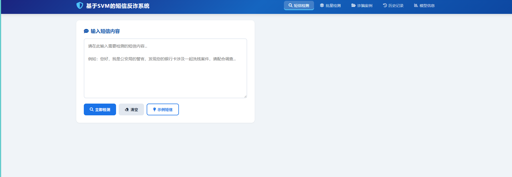
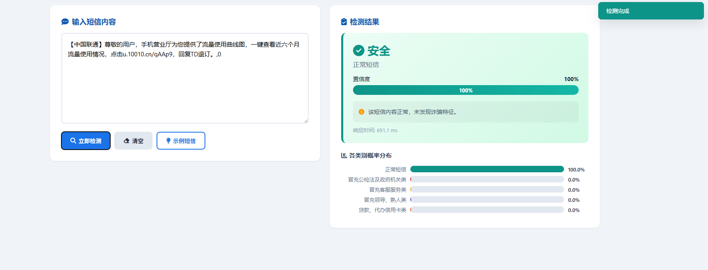
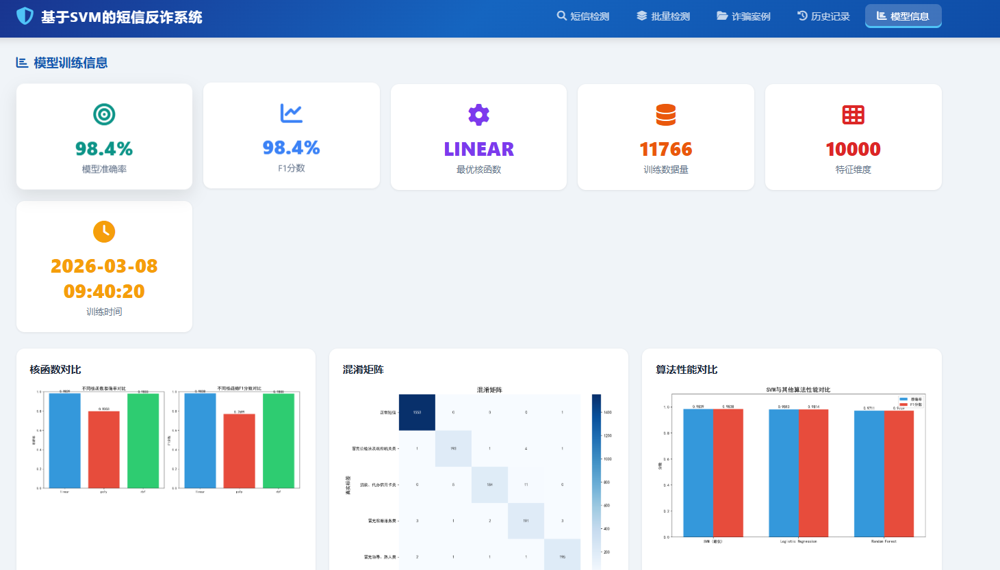

# 基于 SVM 的短信反诈识别系统

## 项目定位

这是一个基于文本分类的短信风险识别项目。系统对短信进行清洗、中文分词和 TF-IDF 特征提取，再使用 SVM 模型判断短信类别，并通过 Web 页面展示单条预测、批量识别和模型评估结果。

## 功能模块

- 数据处理：读取短信数据，清理无效内容，完成训练集和测试集准备。
- 中文文本处理：使用 jieba 分词，把短信文本转换为可计算的词语特征。
- 特征工程：使用 TF-IDF 将文本转换为向量，支持特征保存和加载。
- 模型训练：训练 SVM 分类器，调整参数并保存模型。
- 单条检测：输入一条短信，返回预测类别和风险判断。
- 批量检测：上传或读取多条短信，批量输出分类结果。
- 模型评估：计算准确率、精确率、召回率、F1 等指标，并绘制分析图表。
- Web 展示：使用 Flask 提供浏览器访问页面，集中展示预测和评估结果。

## 技术实现

- Python、Flask：完成服务端接口和 Web 页面。
- scikit-learn：实现 SVM、数据划分、指标计算和模型处理。
- jieba、TF-IDF：完成中文分词和文本向量化。
- Pandas、NumPy：完成数据整理和数值计算。
- Matplotlib、Seaborn：生成混淆矩阵、指标对比和结果可视化。

## 可以做什么

可用于短信反诈演示、垃圾短信分类、客服文本筛选、舆情文本分类和风险消息预警，也可以替换训练数据来识别其他类型的中文文本。

## 模块说明

| 模块 | 主要内容 |
| --- | --- |
| 数据集管理 | 读取短信样本，整理标签和文本内容，准备训练与测试数据。 |
| 文本预处理 | 清理文本、进行中文分词，并处理停用词或无效字符。 |
| 特征提取 | 使用 TF-IDF 把短信转换为机器学习模型可以处理的特征向量。 |
| 模型训练 | 训练 SVM 分类器，调整参数并保存模型和向量化配置。 |
| 风险识别 | 支持输入单条短信进行预测，也支持批量文本检测。 |
| 评估分析 | 输出准确率、精确率、召回率、F1、混淆矩阵等结果。 |
| Web 页面 | 提供浏览器操作入口，展示预测结果和模型分析图表。 |

## 典型使用流程

先准备带标签的短信数据，完成清洗、分词和 TF-IDF 向量化；训练 SVM 并在测试集上评估；部署 Flask 页面后，用户输入短信或提交批量数据，系统返回分类结果和风险提示。

## 技术分工

Pandas 和 NumPy 用于数据整理；jieba 负责中文分词；TF-IDF 完成文本向量化；scikit-learn 实现 SVM 训练、预测和指标计算；Flask 封装 Web 接口和页面；Matplotlib、Seaborn 生成混淆矩阵、指标对比和分类结果图表。

## 实际运行效果

以下为论文中提取的系统实际运行界面和分析结果截图，已移除个人信息与学校标识。

[返回项目总览](../README.md)
