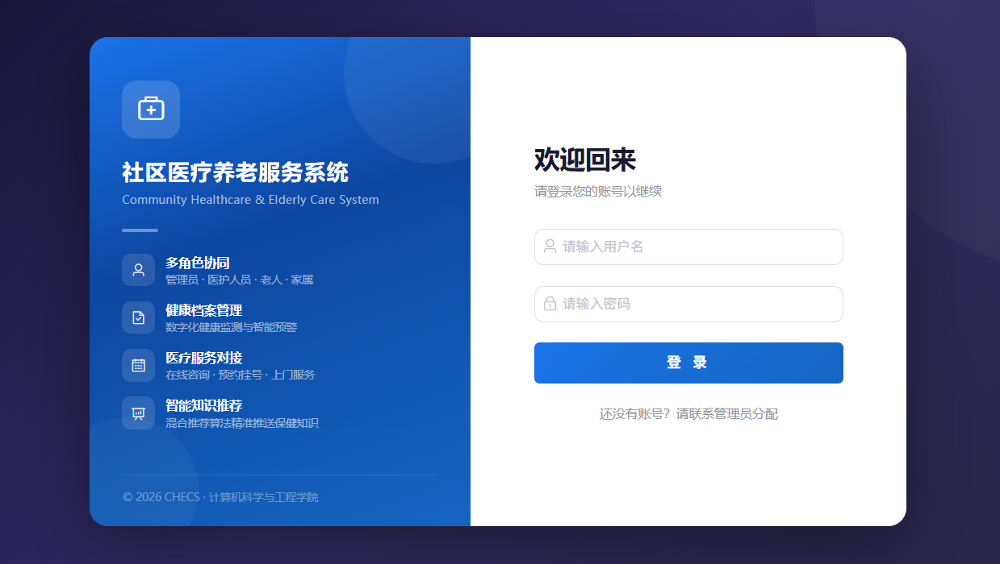
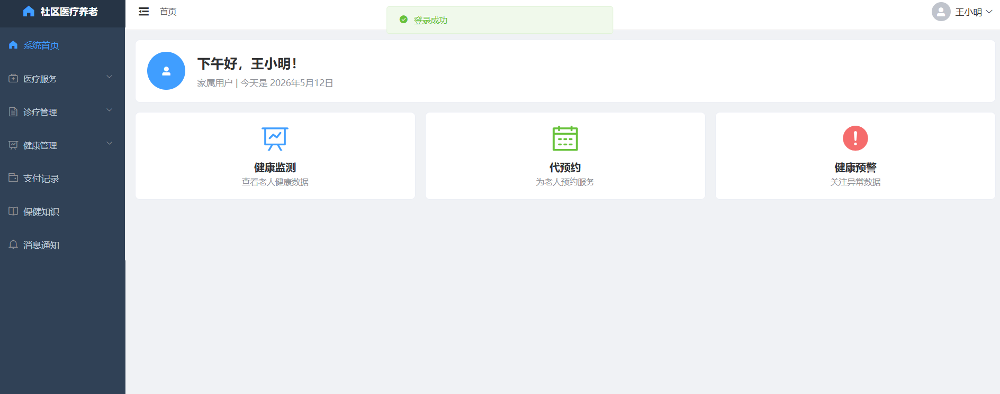
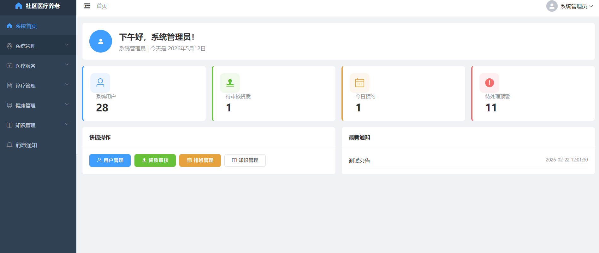

# 面向社区的医疗养老服务系统

## 项目定位

这是一个面向社区居民、医护人员、养老服务人员和管理员的综合服务平台。系统把居民健康档案、健康监测、在线咨询、预约服务和养老服务流程整合起来，并提供管理后台和微信小程序端。

## 功能模块

- 居民端：注册登录、维护健康档案、查看健康数据、在线咨询和提交服务预约。
- 医护/服务人员端：查看服务任务、处理咨询、管理排班和更新服务记录。
- 养老服务：展示养老服务项目，接收预约申请，记录服务处理过程。
- 健康档案：维护居民基本健康资料、监测数据和历史服务记录。
- 审核管理：处理服务人员资质、账号和业务申请审核。
- 运营管理：管理用户、服务项目、排班、预约和平台数据统计。
- 微信小程序：提供居民侧的轻量化访问入口，适合移动端预约和信息查看。

## 技术实现

- 后端：Java、Spring Boot、Spring Security、JWT、MyBatis-Plus、MySQL、Redis。
- 前端：Vue、Axios、ECharts 等 Web 管理端技术。
- 移动端：微信小程序原生开发，通过接口访问后端业务。
- 实现方式：按角色控制功能权限，使用 REST API 连接管理端、小程序端和后端服务，Redis 用于缓存或业务辅助处理。

## 可以做什么

可用于社区医疗、居家养老、健康服务预约和护理服务管理，也可以扩展家庭医生、健康提醒、服务评价、消息通知和电子档案等功能。

## 模块说明

| 模块 | 主要内容 |
| --- | --- |
| 居民服务 | 居民登录、查看健康信息、提交预约、在线咨询和查看服务状态。 |
| 健康档案 | 管理居民基础健康资料、健康监测信息和历史服务记录。 |
| 医疗咨询 | 提供咨询入口，支持服务人员查看和处理咨询事项。 |
| 养老服务 | 展示养老服务项目，接收预约申请并记录服务过程。 |
| 人员与审核 | 管理医护/服务人员资料、资质审核和排班信息。 |
| 预约管理 | 维护预约时间、服务对象、服务人员和处理状态。 |
| 运营统计 | 汇总用户、健康服务、预约和平台运营数据。 |

## 典型使用流程

居民通过微信小程序或服务端页面登录，完善健康档案并选择医疗/养老服务；系统生成预约记录，服务人员按排班接收任务并更新处理状态；管理员负责审核人员资料、维护服务项目和查看运营统计。

## 技术分工

Spring Boot 提供用户、档案、预约和服务接口；Spring Security 与 JWT 负责认证授权；MyBatis-Plus 负责数据访问；MySQL 保存健康和业务数据；Redis 用于缓存或临时状态处理；Vue 构建管理后台；微信小程序提供居民移动端入口。

## 实际运行效果

以下为论文中提取的实际运行界面截图，已避开学校标识和个人信息。

[返回项目总览](../README.md)
