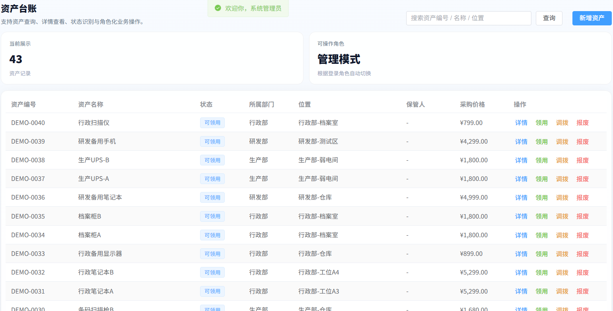
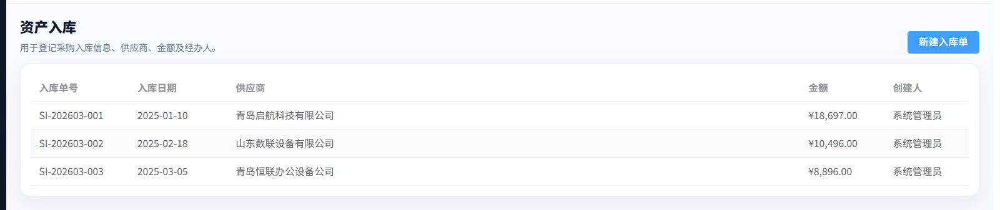
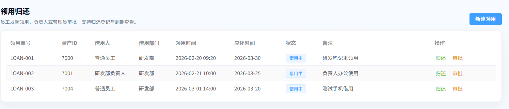

# 企业资产管理系统（定制版）

## 项目定位

这是一个面向企业内部固定资产和办公资产管理的 Web 系统。系统围绕资产从登记、领用、调拨、维修、盘点到报废/离职交接的过程建立业务记录，帮助管理人员掌握资产去向和当前状态。

## 功能模块

- 用户权限：管理员、普通员工等角色登录和权限控制。
- 资产基础资料：维护资产分类、资产编号、名称、位置、状态和采购信息。
- 资产台账：按编号、名称、位置等条件查询资产，查看资产详情和历史记录。
- 领用归还：员工发起领用，管理员审批，记录领用时间、归还时间和使用状态。
- 调拨管理：在部门、仓库或使用位置之间转移资产，保留调拨记录。
- 维修管理：登记故障、维修进度、维修结果和相关费用。
- 盘点管理：生成盘点任务，核对账面资产和实际状态。
- 报废与交接：处理报废申请、离职交接和资产责任转移。
- 统计看板：汇总资产数量、状态、部门分布和业务处理情况。

## 技术实现

- 后端：Java、Spring Boot、Spring Security、JWT、MyBatis-Plus、MySQL。
- 前端：Vue 3、TypeScript、Element Plus、Pinia、ECharts、Axios。
- 实现方式：前后端分离，使用角色权限控制业务入口，MySQL 保存资产和流程数据，ECharts 展示统计结果。

## 可以做什么

可用于企业固定资产、办公设备、IT 设备和实验仪器管理，也可以按企业流程扩展审批、二维码盘点、合同管理、折旧计算和消息提醒。

## 模块说明

| 模块 | 主要内容 |
| --- | --- |
| 资产基础资料 | 维护资产分类、编号、名称、位置、采购信息和资产状态。 |
| 资产台账 | 按编号、名称、部门或位置查询资产，查看资产当前状态和历史记录。 |
| 领用归还 | 员工提交领用申请，管理员处理申请并记录领用、归还和责任人。 |
| 调拨管理 | 处理部门、仓库或使用位置之间的资产转移，保留流转记录。 |
| 维修管理 | 记录故障、报修、维修进度、维修结果和相关费用。 |
| 盘点管理 | 创建盘点任务，核对账面记录与实际资产状态。 |
| 报废交接 | 处理报废申请、离职交接和资产责任变更。 |
| 统计看板 | 汇总资产数量、状态、部门分布和各类业务处理情况。 |

## 典型使用流程

管理员建立资产分类和台账，员工提出领用申请后由管理人员处理；资产发生部门变更、维修或离职交接时，系统追加对应业务记录；盘点和报废流程完成后，资产状态及统计结果同步更新。

## 技术分工

Spring Boot 提供资产和流程接口；Spring Security、JWT 负责身份认证及角色权限；MyBatis-Plus 负责数据持久化；MySQL 保存资产台账和操作记录；Vue 3、TypeScript、Pinia 组织前端页面与状态；Element Plus 提供管理组件；ECharts 展示资产统计图表。

## 实际运行效果

以下为论文中提取的实际运行界面截图，已避开姓名、学号和学校标识。

[返回项目总览](../README.md)
