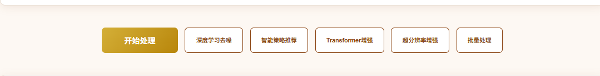
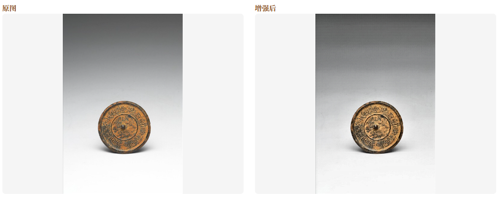
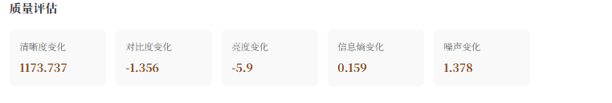

# 青铜文化图像增强系统

## 项目定位

这是一个面向青铜器及相关文化图像处理的 Web 系统。用户上传图像后，可以选择不同的增强处理方式，查看处理前后效果，并通过质量指标辅助比较不同算法的结果。

## 功能模块

- 图像上传：上传待处理的青铜器图片，检查图片格式和尺寸。
- 预设处理：选择系统提供的处理方案，快速完成常用增强任务。
- 图像去噪：降低噪声和压缩痕迹，改善图像整体观感。
- 细节增强：强化纹理、边缘和局部细节，便于观察器物特征。
- 超分辨率：通过深度学习模型提升图像分辨率和细节表现。
- 批量处理：对多张图片执行相同处理流程，适合数据整理和实验对比。
- 结果对比：并排查看原图与处理结果，支持下载或保存处理后的图片。
- 质量评价：计算图像质量指标，为算法效果比较提供参考。

## 技术实现

- Web 服务：Python、Flask。
- 深度学习：PyTorch、TorchVision，用于模型加载和图像增强推理。
- 图像处理：OpenCV、Pillow、NumPy、SciPy、scikit-image。
- 实现方式：浏览器提交图片和处理参数，Flask 调用传统算法或深度学习模型，返回处理结果及评价数据。

## 可以做什么

可用于文物图像修复辅助、博物馆数字化、低质量图片增强、图像预处理和计算机视觉算法演示，也可以替换数据集扩展到老照片、工业检测或医学图像增强等场景。

## 模块说明

| 模块 | 主要内容 |
| --- | --- |
| 图片输入 | 上传单张或多张待处理图片，并完成格式、尺寸等基础检查。 |
| 算法选择 | 选择去噪、细节增强、超分辨率或其他预设处理流程。 |
| 图像处理 | 调用 OpenCV、传统图像算法或 PyTorch 模型生成增强结果。 |
| 批量任务 | 对多张图片执行统一处理，减少重复操作并便于实验记录。 |
| 效果对比 | 展示原图和结果图，帮助用户直观看到清晰度、细节和噪声变化。 |
| 质量评价 | 计算相关图像质量指标，用于不同算法或参数结果的比较。 |

## 典型使用流程

用户上传青铜器图像并选择处理方式，系统完成预处理和模型推理后返回增强图片；用户在对比页面查看原图与结果，并结合质量指标选择合适的处理方案，必要时可继续批量处理其他图片。

## 技术分工

Flask 负责上传接口、参数接收和结果返回；OpenCV、Pillow、NumPy、SciPy、scikit-image 负责图像读写和传统处理；PyTorch、TorchVision 负责深度学习模型加载与推理；Web 页面将算法调用封装为可操作的图片处理流程。

## 实际运行效果

以下为论文中提取的系统实际运行界面截图，已移除姓名、学号、学校和指导教师信息。

[返回项目总览](../README.md)
