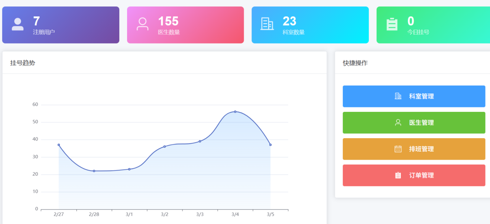
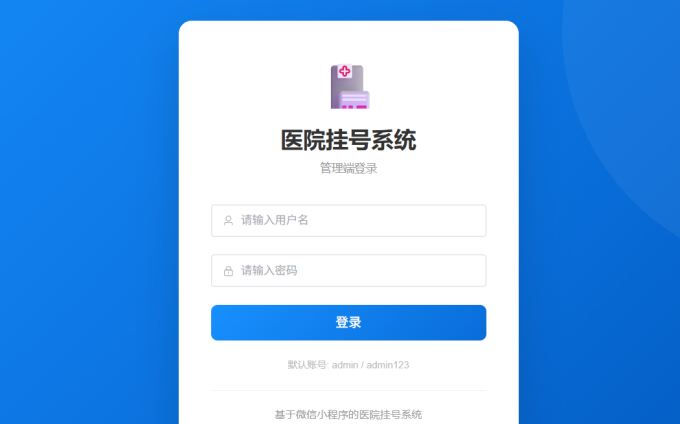
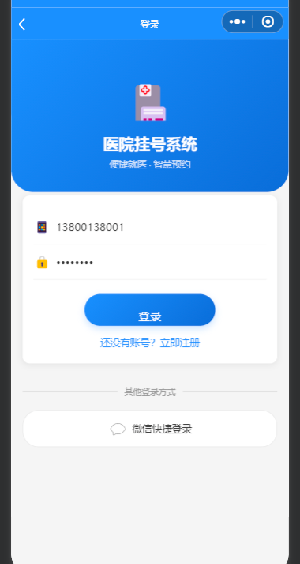

# 医院多端挂号系统

## 项目定位

这是一个包含管理后台、医生工作台和患者微信小程序端的在线预约挂号系统。系统把科室、医生、排班、号源、患者预约和订单管理连接起来，覆盖医院预约服务的主要流程。

## 功能模块

- 患者端：登录、查看科室和医生、浏览排班号源、选择时间预约、查看预约订单。
- 医生工作台：查看个人排班和预约记录，处理就诊相关业务信息。
- 科室医生管理：维护科室、医生资料、职称和出诊信息。
- 排班号源：设置医生出诊日期、时间段、可预约数量和剩余号源。
- 挂号订单：创建预约订单，查看订单状态、预约时间和业务记录。
- 管理后台：管理用户、科室、医生、排班、号源和系统基础数据。
- 统计模块：查看预约量、号源使用情况和后台运营数据。

## 技术实现

- 后端：Java、Spring Boot、MyBatis、MySQL、Redis、JWT。
- 管理端：Vue 3、Element Plus、Pinia、Axios。
- 移动端：微信小程序原生开发。
- 实现方式：多端共用后端接口，JWT 负责登录鉴权，Redis 辅助处理缓存或号源相关业务，MySQL 保存用户和挂号数据。

## 可以做什么

可用于医院预约挂号、诊所预约、体检预约和医疗服务排班，也可以扩展缴费、检查预约、报告查询、评价和消息通知等功能。

## 模块说明

| 模块 | 主要内容 |
| --- | --- |
| 患者端 | 登录后查看科室、医生和可预约号源，提交预约并查看订单状态。 |
| 科室医生 | 维护科室信息、医生资料、职称和出诊信息。 |
| 排班号源 | 设置出诊日期、时间段和可预约数量，实时反映号源状态。 |
| 挂号订单 | 创建和查询预约订单，保存预约时间、科室、医生和处理状态。 |
| 医生工作台 | 查看个人排班及预约信息，辅助处理日常接诊业务。 |
| 管理后台 | 管理用户、科室、医生、排班、号源和系统基础配置。 |
| 统计分析 | 汇总预约量、号源使用情况和平台业务数据。 |

## 典型使用流程

管理员维护科室、医生和排班号源；患者在微信小程序中选择科室、医生和时间提交预约；系统生成挂号订单并更新剩余号源；医生和管理员在各自工作台查看预约及运营数据。

## 技术分工

Spring Boot 负责多端共用的业务接口；MyBatis 负责数据库访问；MySQL 保存用户、排班、号源和订单；Redis 辅助缓存或号源处理；JWT 负责登录鉴权；Vue 3 和 Element Plus 构建管理端；微信小程序提供患者移动端访问入口。

## 实际运行效果

以下为论文中提取的实际运行界面截图，已避开个人信息和学校标识。

[返回项目总览](../README.md)
