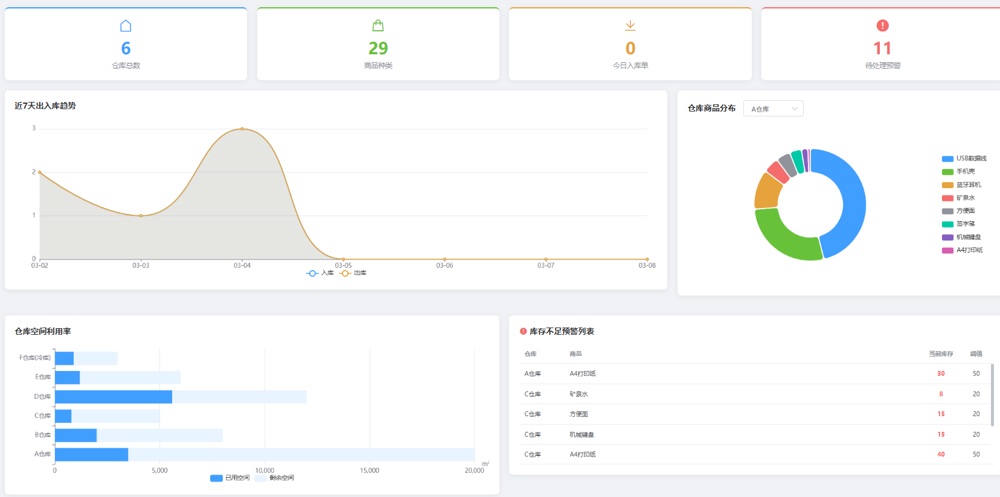
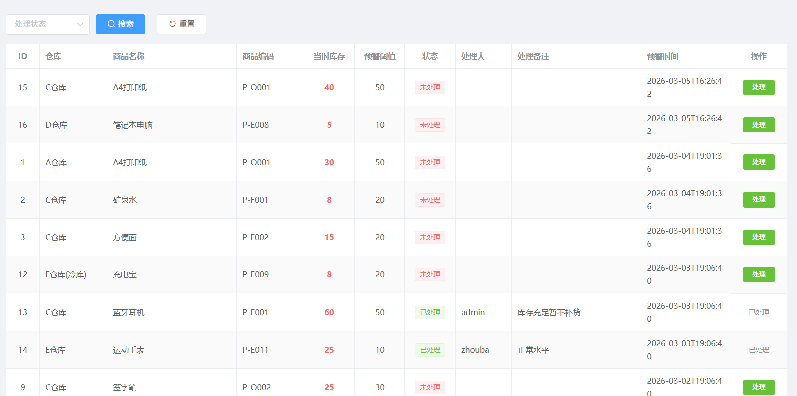
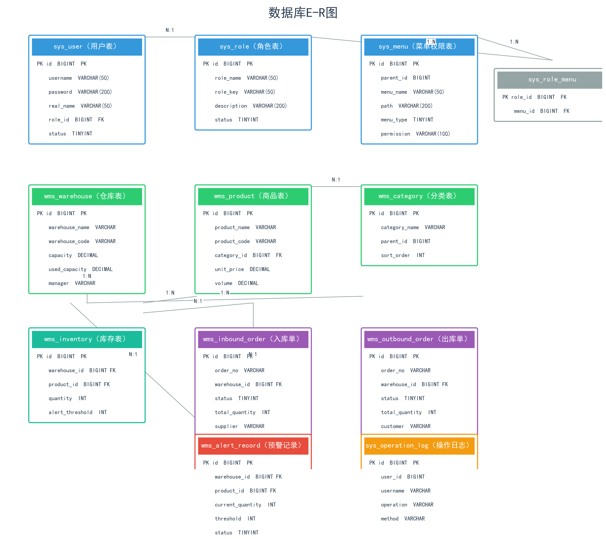

# 智慧仓库存储系统

## 项目定位

这是一个面向仓储业务的库存和出入库管理系统。系统把仓库、物料、入库单、出库单和库存流水统一管理，并通过盘点和低库存预警帮助管理人员掌握库存状态。

## 功能模块

- 用户权限：登录、角色管理和仓储业务功能访问控制。
- 仓库管理：维护仓库、库区、位置和仓库基础信息。
- 物料管理：维护物料分类、编号、名称、规格、单位和安全库存。
- 入库管理：创建入库单、登记入库数量、确认入库并更新库存。
- 出库管理：创建出库单、审核出库、登记出库数量并生成库存流水。
- 库存管理：查询库存余额、库存变动、库存调整和盘点结果。
- 预警模块：根据安全库存识别低库存物料，提示补货或处理。
- 数据看板：展示库存数量、出入库趋势、预警数据和仓储业务统计。

## 技术实现

- 后端：Java、Spring Boot、Spring Security、JWT、MyBatis-Plus、MySQL。
- 前端：Vue、Axios、ECharts。
- 实现方式：前后端分离，业务单据确认后同步更新库存和流水，ECharts 用于仓储数据可视化。

## 可以做什么

可用于企业仓库、门店库存、实验室耗材和生产物料管理，也可以扩展多仓库调拨、条码/二维码、采购计划和供应商管理。

## 模块说明

| 模块 | 主要内容 |
| --- | --- |
| 仓库基础资料 | 维护仓库、库区、库位和仓储相关的基础信息。 |
| 物料管理 | 管理物料分类、编码、名称、规格、单位和安全库存。 |
| 入库管理 | 创建入库单、录入数量、确认入库并增加库存余额。 |
| 出库管理 | 创建出库单、处理出库并减少对应库存。 |
| 库存流水 | 记录入库、出库、盘点和调整造成的库存变化，方便追溯。 |
| 盘点调整 | 核对账面库存和实际库存，对差异进行调整并保留记录。 |
| 预警看板 | 根据安全库存识别低库存物料，并展示出入库趋势和业务统计。 |

## 典型使用流程

管理员先建立仓库和物料资料；发生采购或收货时创建入库单，发货时创建出库单；系统根据单据确认结果更新库存和流水；库存低于安全值时生成预警，管理人员可以通过盘点和看板进行核对。

## 技术分工

Spring Boot 提供仓库、物料、单据和库存接口；Spring Security 与 JWT 控制登录和权限；MyBatis-Plus 负责数据持久化；MySQL 保存库存业务数据；Vue 和 Axios 完成管理页面及接口通信；ECharts 用于库存趋势、结构分布和预警数据展示。

## 实际运行效果

以下为论文中提取的实际运行界面截图，已避开姓名、学号和学校标识。

[返回项目总览](../README.md)
