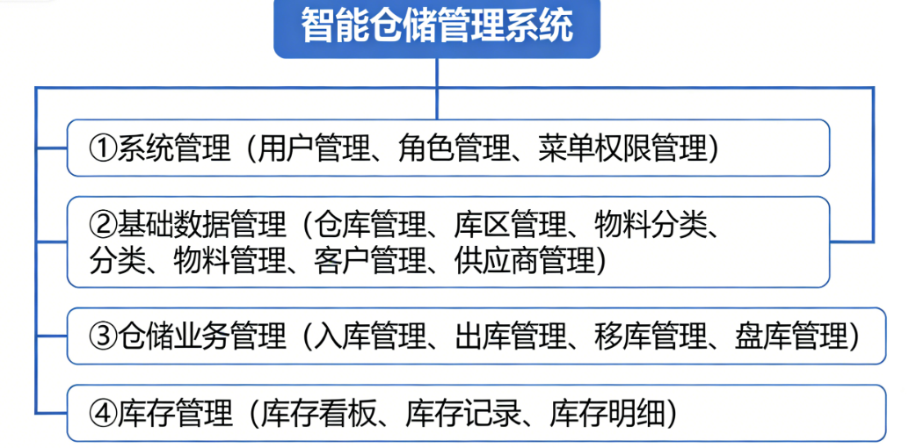
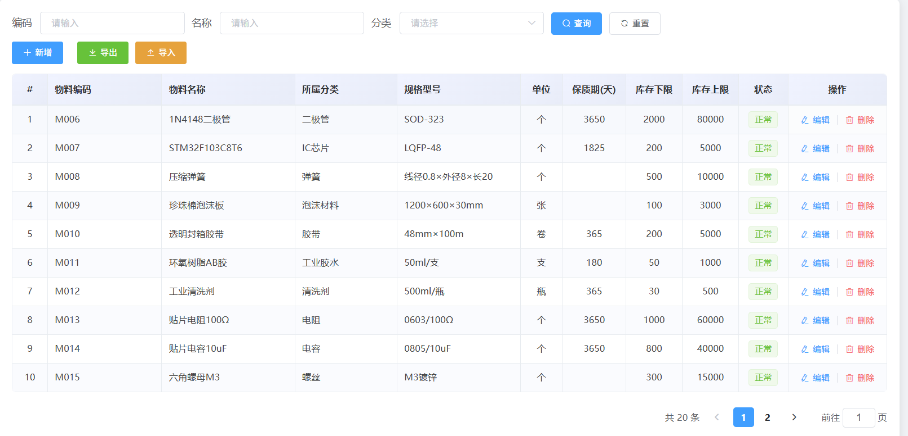
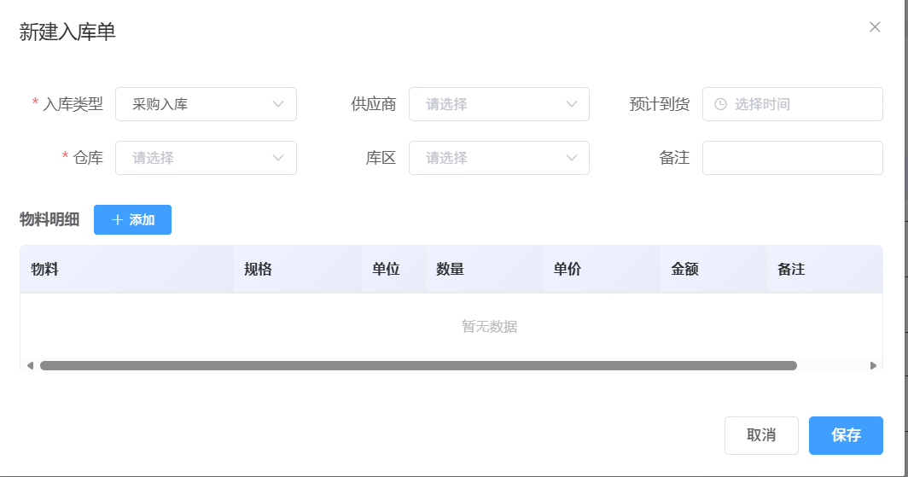

# 智能仓库管理系统

## 项目定位

这是一个覆盖多仓库、多物料和供应链基础业务的仓储管理平台。系统围绕仓库、物料、供应商、客户、采购/销售单据和库存流水建立业务关系，支持仓库间调拨和运营数据查看。

## 功能模块

- 基础资料：维护仓库、库区、物料分类、物料、供应商和客户信息。
- 用户权限：管理用户、角色和系统功能权限。
- 采购入库：登记采购订单，处理到货和入库，形成库存增加流水。
- 销售出库：维护销售订单，处理出库，形成库存减少流水。
- 仓库调拨：在不同仓库或库区之间调拨物料，记录调出和调入过程。
- 库存盘点：查看库存余额，执行盘点、调整和差异处理。
- 流水追踪：查询物料库存变动和相关业务单据，便于追溯。
- 数据看板：展示库存、订单、仓库和业务处理统计。

## 技术实现

- 后端：Java、Spring Boot、MyBatis、MySQL、Redis、JWT。
- 前端：Vue、Element UI、ECharts、Axios。
- 实现方式：以业务单据驱动库存变化，使用角色权限控制菜单和接口访问，Redis 辅助缓存或业务处理，ECharts 展示关键指标。

## 可以做什么

可用于企业仓储、供应链、生产物料和批发零售库存管理，也可以继续扩展条码扫描、批次/保质期、采购审批、物流跟踪和多组织管理。

## 模块说明

| 模块 | 主要内容 |
| --- | --- |
| 多仓库基础资料 | 维护仓库、库区、物料分类、物料、供应商和客户等信息。 |
| 采购入库 | 管理采购订单、采购明细和到货入库，形成库存增加记录。 |
| 销售出库 | 管理销售订单、销售明细和出库业务，形成库存减少记录。 |
| 仓库调拨 | 在仓库或库区之间转移物料，记录调出、调入和状态变化。 |
| 库存盘点 | 查看库存余额，处理盘点任务、差异和库存调整。 |
| 流水追踪 | 根据物料、单据或时间查询库存变动来源。 |
| 权限配置 | 管理用户、角色、菜单和仓储业务操作权限。 |
| 数据看板 | 查看订单、库存、仓库和业务处理的汇总指标。 |

## 典型使用流程

先维护供应商、客户、物料和仓库资料；采购单确认后办理入库，销售单确认后办理出库；不同仓库之间通过调拨完成库存转移；系统持续记录库存流水，管理员通过盘点和数据看板检查业务状态。

## 技术分工

Spring Boot 承担仓储业务接口；MyBatis 负责数据访问；MySQL 保存基础资料、订单和库存流水；Redis 辅助缓存或业务处理；JWT 控制接口访问；Vue、Element UI 和 Axios 构建管理端；ECharts 展示库存和供应链统计。

## 实际运行效果

以下为论文中提取的实际运行界面截图，使用演示数据且不含姓名、学号或学校标识。

[返回项目总览](../README.md)
